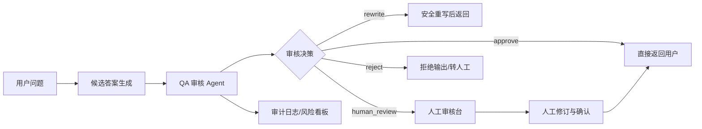
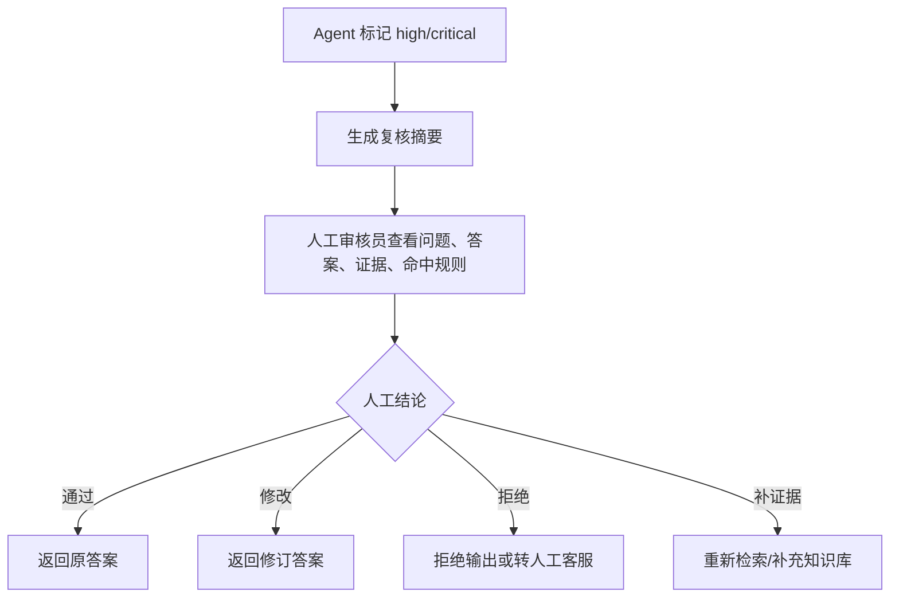

# 业务流程梳理

## 1. 总体流程

## 2. 审核阶段

### 阶段一：输入规范化

目标：把原始问答整理为统一状态。

处理内容：

- 去除多余空白。
- 标准化证据列表。
- 初始化审核状态。
- 记录输入异常。

### 阶段二：规则安全审核

目标：快速识别硬风险。

处理内容：

- 个人信息泄露。
- 违法违规表达。
- 自伤、暴力、仇恨、色情。
- 提示词攻击或越权请求。

### 阶段三：业务一致性审核

目标：判断回答是否符合业务边界。

处理内容：

- 是否答非所问。
- 是否超出业务授权。
- 是否做出绝对化承诺。
- 是否涉及价格、合同、赔偿等敏感承诺。

### 阶段四：证据一致性审核

目标：降低 RAG 与生成式问答幻觉风险。

处理内容：

- 答案是否引用或依赖证据。
- 证据是否支持答案核心结论。
- 答案是否包含证据中没有的强承诺。

### 阶段五：风险评分与路由

目标：让审核输出可执行。

路由规则：

| 风险等级 | 典型场景 | 处理 |
|---|---|---|
| low | 轻微格式问题，无实质风险 | 通过 |
| medium | 证据不足、表述过强、轻微不一致 | 重写 |
| high | 隐私、超授权、明显事实冲突 | 人工复核 |
| critical | 严重违法违规、敏感隐私直接输出 | 拒绝或强制人工 |

## 3. 人工复核流程

## 4. 关键业务指标

- 自动通过率。
- 人工复核率。
- 高风险拦截率。
- 重写成功率。
- 误杀率。
- 漏检率。
- 平均审核耗时。
- 单业务线风险分布。
