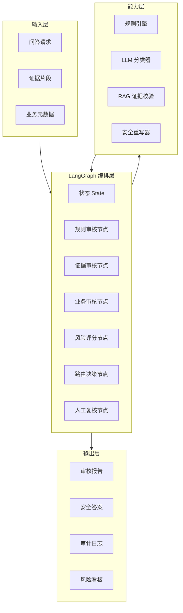

# 项目整体架构设计

## 1. 架构视图

## 2. 分层设计

### 2.1 接入层

负责接收业务系统请求：

- 客服机器人。
- 企业知识库助手。
- 内部问答系统。
- RAG 服务。
- 工单系统。

### 2.2 编排层

采用 LangGraph `StateGraph` 思路组织审核流程：

- 每个节点只负责一个清晰职责。
- 节点之间通过共享状态传递审核结果。
- 条件边根据风险等级决定下一步。
- 高风险节点进入人工复核。
- 通过 checkpoint 支持暂停和恢复。

### 2.3 能力层

能力模块可逐步增强：

- 第一阶段：规则引擎。
- 第二阶段：LLM 风险分类器。
- 第三阶段：RAG 证据一致性检查。
- 第四阶段：人审反馈驱动规则和模型评测优化。

### 2.4 数据层

建议沉淀：

- 审核任务表。
- 节点执行日志。
- 命中规则表。
- 人工复核结果。
- 风险样本集。
- 业务线策略配置。

## 3. 状态模型

核心状态字段：

| 字段 | 说明 |
|---|---|
| `case_id` | 审核任务 ID |
| `question` | 用户问题 |
| `answer` | 候选答案 |
| `evidence` | 证据片段 |
| `business` | 业务线 |
| `issues` | 风险问题列表 |
| `risk_level` | 风险等级 |
| `score` | 风险分 |
| `decision` | 最终决策 |
| `safe_answer` | 重写后答案 |
| `audit_trace` | 节点执行轨迹 |

## 4. 技术选型

| 模块 | 建议 |
|---|---|
| 编排框架 | LangGraph |
| API 服务 | FastAPI |
| 规则配置 | YAML/JSON + Python rule adapter |
| LLM 接入 | LangChain model adapter |
| 向量检索 | 企业现有 RAG/向量库 |
| 存储 | PostgreSQL |
| 审计日志 | PostgreSQL + 对象存储 |
| 可观测 | LangSmith / OpenTelemetry |

## 5. 部署建议

第一阶段建议以离线批处理和 API 服务并行：

1. 离线审核历史 QA 数据，形成风险样本集。
2. 接入低风险业务线做旁路审核，只记录不拦截。
3. 接入正式链路，对中高风险内容进行拦截或转人工。
4. 建立风险看板和人工复核台。

## 6. 安全与治理

- 不把敏感原文直接送往外部模型。
- 人工复核必须保留操作记录。
- 高风险规则变更需要审批。
- 模型输出不能覆盖规则硬拦截。
- 对外输出前必须经过最终决策节点。
