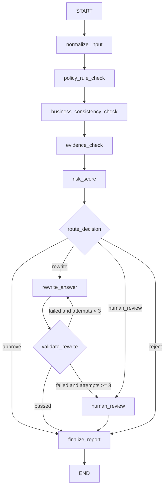

# LangGraph 节点编排设计

## 1. 编排原则

LangGraph 适合此类审核 Agent，因为 QA 审核不是单次模型调用，而是一个有状态、多步骤、可分支、可暂停恢复的流程。

设计原则：

- 状态显式：所有节点读写统一 `AuditState`。
- 节点单责：一个节点只处理一类审核。
- 条件路由：根据风险等级进入通过、重写、拒绝或人工。
- 人机协同：高风险内容通过 interrupt/checkpoint 进入人工复核。
- 可观测：节点输出都进入 `audit_trace`。

## 2. 节点定义

| 节点 | 职责 | 输入 | 输出 |
|---|---|---|---|
| `normalize_input` | 清洗和标准化输入 | 原始 QA | 标准化 QA |
| `policy_rule_check` | 基础安全和隐私规则 | QA 文本 | 规则命中 issues |
| `business_consistency_check` | 业务边界校验 | QA + business | 业务风险 issues |
| `evidence_check` | 证据一致性校验 | answer + evidence | 证据风险 issues |
| `risk_score` | 风险评分 | issues | risk_level + score |
| `route_decision` | 路由判断 | risk_level | decision |
| `rewrite_answer` | 安全重写 | answer + issues | safe_answer |
| `validate_rewrite` | 循环验证重写结果 | safe_answer | 通过、重写或转人工 |
| `human_review` | 人工复核 | 审核报告 | 人工结论 |
| `finalize_report` | 输出报告 | 全量状态 | AuditResult |

## 3. 条件边设计



## 4. 循环验证设计

为了保证“最终输出的是合理内容”，`rewrite_answer` 后不直接结束，而是进入 `validate_rewrite`：

- 对 `safe_answer` 再跑一轮隐私、安全、业务承诺和证据规则。
- 如果仍命中中高风险问题，则回到 `rewrite_answer` 重新生成。
- 每次重写都会增加 `rewrite_attempts`。
- 达到最大次数仍未通过，则路由到 `human_review`。
- 通过验证后，才将最终决策更新为 `approve`，并输出 `safe_answer`。

## 5. 状态流转

节点之间不直接传递零散参数，而是更新统一状态：

```python
class AuditState(TypedDict, total=False):
    case_id: str
    question: str
    answer: str
    evidence: list[str]
    business: str
    issues: list[dict]
    risk_level: str
    score: int
    decision: str
    safe_answer: str | None
    rewrite_attempts: int
    rewrite_validation_passed: bool
    audit_trace: list[dict]
```

## 6. 人工复核设计

高风险内容进入 `human_review`：

- LangGraph 运行到该节点时暂停。
- 将问题、答案、证据、风险命中、建议决策发送到人工审核台。
- 人工返回 `approve`、`reject`、`edit` 或 `need_more_evidence`。
- 图恢复执行，生成最终报告。

## 7. 节点扩展方向

### 6.1 LLM 风险分类节点

用于处理规则难以覆盖的语义风险：

- 是否答非所问。
- 是否含隐性承诺。
- 是否存在不当医疗/法律/金融建议。
- 是否存在政策规避或诱导攻击。

### 6.2 RAG 证据校验节点

用于判断答案是否被证据支持：

- 提取答案关键断言。
- 与 evidence 逐条匹配。
- 标记 unsupported claims。

### 6.3 业务策略节点

不同业务线可设置不同阈值：

- 售前：严格限制价格、合同、承诺。
- 客服：严格限制隐私查询、账号操作。
- 内部知识库：关注权限与内部信息泄露。

## 8. 当前代码落地

当前项目已实现：

- `pipeline.py`：无外部依赖的本地审核链路。
- `rules.py`：规则引擎。
- `graph.py`：LangGraph `StateGraph` 编排骨架。

后续只需要安装 `langgraph`，即可通过 `build_graph()` 编译图。
