# 审核规则与风险识别流程

## 1. 风险分类

| 分类 | 风险等级 | 例子 |
|---|---|---|
| 隐私泄露 | critical/high | 输出身份证、手机号、银行卡 |
| 违法违规 | critical | 协助违法、欺诈、绕过监管 |
| 自伤暴力 | high/critical | 鼓励自伤或暴力行为 |
| 仇恨辱骂 | medium/high | 针对群体的歧视攻击 |
| 色情低俗 | medium/high | 不适宜内容 |
| 越权承诺 | medium/high | 永久免费、保证成功、一定赔付 |
| 证据不足 | medium | 无证据支持关键结论 |
| 事实冲突 | high | 答案与证据相反 |
| 答非所问 | medium | 未回答用户核心问题 |
| 输入异常 | medium | 空问题、空答案、结构异常 |

## 2. 风险评分建议

基础分：

- low：0-29
- medium：30-59
- high：60-84
- critical：85-100

命中规则加权：

| 规则类型 | 加分 |
|---|---:|
| 输入异常 | 25 |
| 证据不足 | 35 |
| 越权承诺 | 45 |
| 个人隐私 | 70 |
| 违法违规 | 90 |

最终分数取上限 100。

## 3. 决策规则

| 条件 | 决策 |
|---|---|
| score < 30 | approve |
| 30 <= score < 60 | rewrite |
| 60 <= score < 85 | human_review |
| score >= 85 | reject |

特殊覆盖：

- 命中身份证、银行卡等强隐私输出：至少 high。
- 命中违法违规：critical，默认 reject。
- 缺少证据但无安全风险：rewrite。
- 答案为空：rewrite 或 human_review。

## 4. 审核报告字段

```json
{
  "case_id": "case-001",
  "decision": "human_review",
  "risk_level": "high",
  "score": 75,
  "issues": [
    {
      "rule_id": "PII_PHONE",
      "category": "privacy",
      "severity": "high",
      "field": "answer",
      "message": "答案包含疑似手机号"
    }
  ],
  "suggested_action": "进入人工复核，确认是否具备授权。",
  "safe_answer": null,
  "audit_trace": []
}
```

## 5. 风险识别流程

```mermaid
flowchart TD
  A["收集 question / answer / evidence"] --> B["输入完整性检查"]
  B --> C["基础安全规则"]
  C --> D["隐私规则"]
  D --> E["业务承诺规则"]
  E --> F["证据支持检查"]
  F --> G["风险分累计"]
  G --> H{"风险等级"}
  H -->|low| I["通过"]
  H -->|medium| J["安全重写"]
  H -->|high| K["人工复核"]
  H -->|critical| L["拒绝输出"]
```


